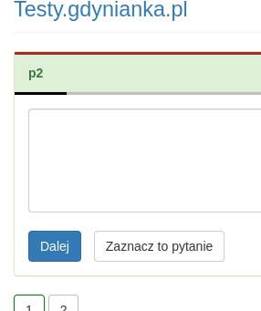
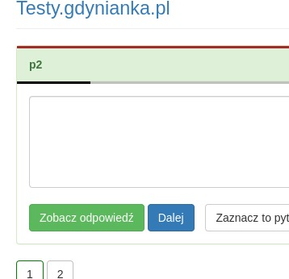
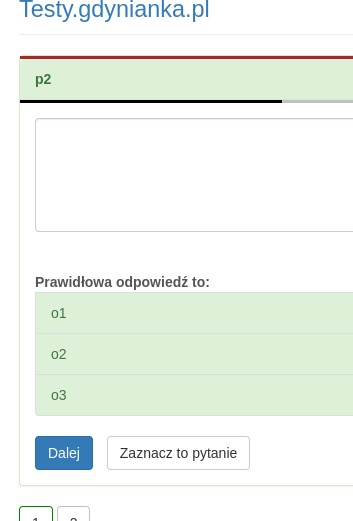

# Gdynianka Hack

Rozszerzenie do Google Chrome włączające tryb pokazywania odpowiedzi podczas rozwiązywania testu na [testy.gdynianka.pl](https://testy.gdynianka.pl).

## Instalacja
- pobierz i rozpakuj [ZIP z rozszerzeniem](https://github.com/chimekkoo/gdynianka-hack/archive/refs/heads/main.zip)
- wejdź w Chrome na [chrome://extensions](chrome://extensions)
- włącz "tryb dewelopera"
- kliknij "załaduj rozpakowane" i wybierz folder `src` z rozpadkowanego wcześniej ZIP'a
- przypnij zainstalowane rozszerzenie do paska w przeglądarce

## Jak używać?
Czerwony kwadrat jako ikona rozszerzenia na pasku to pokazywanie odpowiedzi wyłączone, a zielony to włączone. Żeby zmienić włączyć/wyłączyć wystarczy na nią kliknąć.
Żeby zadziałało, trzeba włączyć pokazywanie odpowiedzi przed rozpoczęciem testu i dla pewności odświeżyć stronę.

Po rozpoczęciu testu przy pytaniach powinien pokazywać się przycisk "Zobacz odpowiedź", po którego kliknięciu pokazują się poprawne odpowiedzi do zadania.

Wyłączone:  

Włączone:  
  
